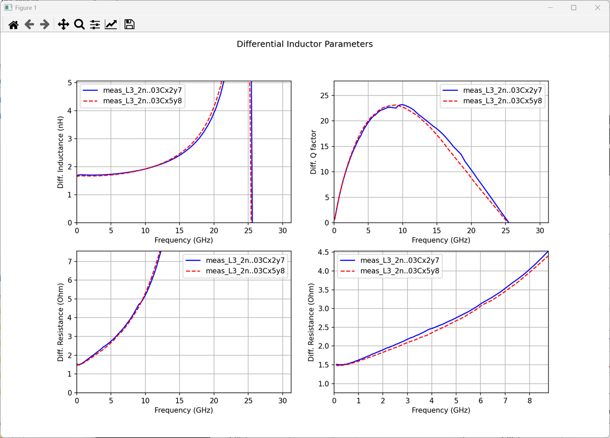
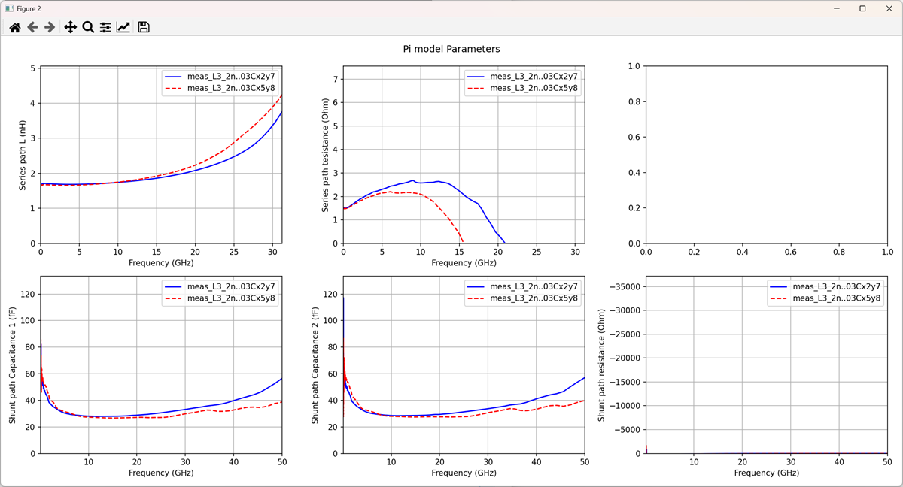

# plot_inductor

plot_inductor reads S-parameter data with 1 or 2 ports (*.s1p, *.s2p) 
for an RFIC inductor and plots the differential mode (symmetric) 
effective L, Q and R over frequency.

It support plotting multiple files, and to debug the reason for possible
differences, the tool plots the extracted effective series and shunt path
elements over frequency. This is really useful to see, for example, if the 
reason for a difference in Q factor is located in series path or shunt path loss.

For 2-port data, the effective differential impedance is calculated first. 
For 1-port data, it is assumed that the data is already in differential (floating port) configuration.


# Prerequisites
The code requires Python3 with the skitkit-rf library.
https://scikit-rf.readthedocs.io/en/latest/tutorials/index.html

# Usage
Ro run the inductor plot and analysis, specify the *.s1p and/or *.s2p file(s) as commandline parameter.

example:
```
python plot_inductor.py measured.s2p simulated.s2p simulated2.s2p
```

The tool plots the effective L, Q and R in differential mode operation ...


... and the extracted effective series and shunt path elements over frequency.




